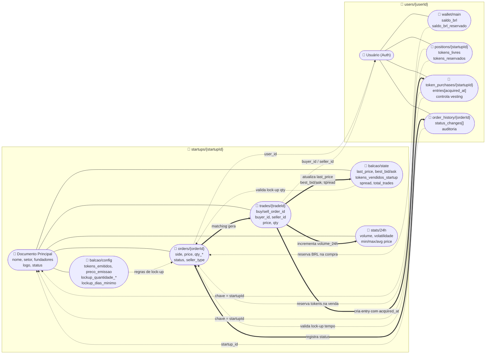

## CONTEXTO DO PROJETO

Aplicativo mobile chamado **MesclaInvest** — rede social de investimento simulado em tokens de startups universitárias (PUC-Campinas / Mescla). Todas as negociações são simuladas, sem dinheiro real ou blockchain. O balcão de tokens é o coração do app, permitindo negociação em tempo real com matching automático, lock-up de liquidez e histórico completo de trades.

**Dados do Firebase:**
- Projeto: `mesclainvest-34c45`
- Emuladores: Funções na porta 5001 (desenvolvimento local)
- Firestore: Modo nativo (NoSQL)
- Storage: Para documentos e evidências

---

## STACK OBRIGATÓRIA

- **Backend**: Node.js + TypeScript (Firebase Cloud Functions)
- **Banco de dados**: Firebase Firestore (NoSQL document-based)
- **Frontend**: Flutter 3.5+ (Dart) com suporte Android/iOS/Web/Windows/macOS
- **Autenticação**: Firebase Auth (Email + Google Sign-In)
- **Realtime**: Firestore listeners para atualização live do book
- **HTTP Client**: Cloud Functions callable ou REST endpoints

---

## FUNCIONALIDADE A IMPLEMENTAR: BALCÃO DE TOKENS (ORDER BOOK)

### Conceito geral

Cada startup possui um order book próprio com duas tabelas: ordens de compra (bid) e ordens de venda (ask). O preço atual do token é sempre o preço da última trade executada (last trade). Se nunca houve trade, o preço exibido é o preço de emissão definido pela startup.

### Regras de negócio obrigatórias

**1. Emissão automática**
Quando uma startup é cadastrada com X tokens a R$ Y, o sistema deve automaticamente criar uma ordem de venda no book com quantidade X e preço Y, com seller_type = "startup".

**2. Ordenação do book**
- Lado compra (bid): ordenado do maior preço para o menor
- Lado venda (ask): ordenado do menor preço para o maior
- O menor ask é sempre executado primeiro, então enquanto a startup tiver tokens disponíveis ela sempre aparece antes dos investidores (desde que seu preço seja o menor)

**3. Tipos de ordem**
- Market order: executa imediatamente consumindo as melhores ordens disponíveis do lado oposto, podendo consumir múltiplas ordens até completar a quantidade solicitada (execução parcial permitida)
- Limit order: entra no book com preço definido pelo usuário e aguarda contraparte. Deve verificar imediatamente se cruza com alguma ordem existente e executar o match se sim

**4. Matching engine**
Após qualquer nova ordem ser inserida, o backend deve rodar o matching engine:
- Pegar o maior bid e o menor ask
- Se bid >= ask, executar trade pela quantidade mínima entre os dois
- Registrar a trade no histórico
- Atualizar quantidades das ordens (execução parcial)
- Remover ordens zeradas
- Repetir até não haver mais cruzamento

**5. Cancelamento de ordem**
O usuário pode cancelar qualquer ordem própria que ainda não foi totalmente executada. O sistema deve:
- Remover a ordem do book
- Devolver o saldo reservado (BRL se era compra, tokens se era venda)
- Registrar status "cancelada" na ordem

**6. Lock-up por quantidade vendida e por tempo**

**Lock-up por Quantidade (Percentual ou Absoluto):**
Investidores NÃO podem colocar ordem de venda enquanto a startup não tiver vendido um volume mínimo de tokens. Este limite pode ser configurado de duas formas:

*Modalidade 1 - Percentual (padrão):*
- Configurável por startup no campo `lockup_quantidade_tipo = "percentual"`
- Campo `lockup_quantidade_valor = 0.5` (significa 50%) varia de 0-1.
- Validação: `tokens_vendidos_startup / tokens_emitidos >= lockup_quantidade_valor`
- Exemplo: se emitiu 10.000 tokens com 50%, precisa vender 5.000 para liberar vendas

*Modalidade 2 - Quantidade Fixa Absoluta:*
- Configurável por startup no campo `lockup_quantidade_tipo = "absoluto"`
- Campo `lockup_quantidade_valor = 5000` (número de tokens)
- Validação: `tokens_vendidos_startup >= lockup_quantidade_valor`
- Exemplo: precisa vender exatamente 5.000 tokens, independentemente do total emitido

- Ordens de venda com `seller_type = "startup"` são sempre permitidas
- O backend deve validar isso antes de aceitar qualquer ordem de venda de um investidor
- Se `lockup_quantidade_tipo` não for definido, usar padrão percentual com 50%

**Lock-up por Tempo:**
Investidores que compram tokens tem uma restrição de tempo antes de poder vender (vesting period). Após X dias da compra, o investidor pode vender seus tokens.
- Configurável por startup no campo `lockup_dias_minimo` (padrão 30 dias)
- Rastreado por usuário em coleção: `users/{userId}/token_purchases/{startupId}`
- Validação: cada token tem uma data de aquisição (`acquired_at`) e só pode ser vendido após `acquired_at + lockup_dias_minimo`
- Se o usuário tiver tokens com datas diferentes, ele só pode vender os "desbloqueados"

**Lógica combinada de validação:**
1. Se for compra → sem validação (sempre permitido)
2. Se for venda de investidor:
   - ✓ Verificar lock-up por quantidade (percentual ou absoluto conforme configurado)
   - ✓ Verificar lock-up por tempo: apenas tokens com `acquired_at + lockup_dias_minimo < agora` podem ser vendidos
   - ✓ Se alguma validação falhar, retornar erro indicando qual restrição está ativa e quando será liberada
3. Se for venda da startup → sempre permitido (sem validações)

**7. Execução parcial**
Ordens podem ser parcialmente executadas. Manter sempre:
- quantidade_original
- quantidade_executada
- quantidade_restante
- status: "aberta" | "parcialmente_executada" | "executada" | "cancelada"

**8. Carteira do usuário**
Cada usuário possui:
- saldo_brl: saldo fictício em reais
- Para cada startup: quantidade de tokens em carteira e quantidade reservada em ordens abertas
- Ao colocar limit order de compra: reservar o valor em BRL (deduzir do saldo disponível)
- Ao colocar limit order de venda: reservar os tokens (mover de tokens_livres para tokens_reservados)

---

## MODELO DE DADOS FIRESTORE

> **PRINCÍPIO DE DESIGN:** O documento principal da startup contém APENAS dados institucionais/de apresentação. TUDO que tocar ou interagir com o balcão (configuração de emissão, lock-ups, preços de mercado, ordens, trades, estatísticas) fica em sub-coleções dedicadas dentro de `startups/{startupId}/balcao/...`. Isso mantém o documento principal leve, evita rewrites por preço (limite Firestore de 1 write/sec por doc) e isola a leitura de quem só quer ver o perfil da startup.

### Visão geral das relações no Firestore

O diagrama abaixo mostra a hierarquia de documentos (linhas sólidas = sub-coleção/contenção) e as relações semânticas entre eles (linhas tracejadas = referência por id; linhas grossas = escritas disparadas pelo matching engine).



**Como ler o diagrama:**
- **`startups/{id}`** mantém só o perfil institucional. Tudo que muda com o balcão fica nas sub-coleções `balcao/`, `orders/`, `trades/` e `stats/`.
- **`users/{id}`** espelha o lado do investidor: carteira BRL, posições por startup, lotes de compra (para vesting) e histórico de ordens.
- **Ligações por id** (tracejadas): orders e trades referenciam usuários por `user_id`/`buyer_id`/`seller_id`; positions e token_purchases usam o `startupId` como chave do documento, evitando duplicar metadados.
- **Escritas do matching engine** (linhas grossas): cada trade executada propaga atualizações para `balcao/state` (preços), `token_purchases` (registra `acquired_at` para o lock-up temporal), `stats/24h` (agregados) e `order_history` (auditoria).
- **Validações de lock-up** consultam três documentos antes de aceitar uma ordem de venda de investidor: `balcao/config` (regras), `balcao/state` (% vendido pela startup) e `token_purchases` (datas de aquisição).

### Coleção: startups (documento principal — APENAS dados institucionais)

```
startups/{startupId}:
{
  id: string,
  nome: string,
  descricao: string,
  setor: string,
  logo_url: string | null,
  site_url: string | null,
  fundadores: string[],
  created_at: timestamp,
  updated_at: timestamp,
  status: "ativa" | "inativa" | "encerrada"
}
```

> NÃO incluir aqui: `tokens_emitidos`, `preco_emissao`, `last_price`, `lockup_*`, nem nenhum dado que mude por causa do book.

### Sub-coleção: startups/{startupId}/balcao (configuração e estado do balcão)

**Doc fixo `config`** — parâmetros definidos no cadastro do balcão (mutáveis só por admin):

```
startups/{startupId}/balcao/config:
{
  tokens_emitidos: number,
  preco_emissao: number,

  // Lock-up por quantidade (duas modalidades)
  lockup_quantidade_tipo: "percentual" | "absoluto", // padrão: "percentual"
  lockup_quantidade_valor: number, // se "percentual": 0.5 (50%), se "absoluto": 5000

  // Lock-up por tempo (vesting)
  lockup_dias_minimo: number, // padrão: 30

  // Limites de proteção
  limite_preco_percentual: number | null, // ex: 0.10 (10% acima/abaixo do last_price)
  qty_maxima_por_ordem: number, // padrão: 100000
  max_ordens_abertas_por_usuario: number, // padrão: 100

  created_at: timestamp,
  updated_at: timestamp
}
```

**Doc fixo `state`** — estado dinâmico atualizado a cada trade:

```
startups/{startupId}/balcao/state:
{
  last_price: number | null,
  tokens_vendidos_startup: number,
  tokens_disponiveis_startup: number,
  best_bid: number | null,   // desnormalizado para leitura rápida
  best_ask: number | null,   // desnormalizado para leitura rápida
  spread: number | null,
  total_trades: number,
  updated_at: timestamp
}
```

### Sub-coleção: startups/{startupId}/orders (livro de ordens da startup)

```
startups/{startupId}/orders/{orderId}:
{
  id: string,
  user_id: string,
  seller_type: "startup" | "investor",
  side: "buy" | "sell",
  order_type: "market" | "limit",
  price: number,
  qty_original: number,
  qty_executada: number,
  qty_restante: number,
  status: "aberta" | "parcialmente_executada" | "executada" | "cancelada",
  version: number,             // optimistic locking
  created_at: timestamp,
  updated_at: timestamp
}
```

> Nada de `startup_id` redundante no doc — a sub-coleção já carrega esse contexto via path.

### Sub-coleção: startups/{startupId}/trades (histórico de trades da startup)

```
startups/{startupId}/trades/{tradeId}:
{
  id: string,
  buy_order_id: string,
  sell_order_id: string,
  buyer_id: string,
  seller_id: string,
  seller_type: "startup" | "investor",
  price: number,
  qty: number,
  executed_at: timestamp,
  spread_at_execution: number,
  impact_price: number          // para análise de slippage
}
```

### Sub-coleção: startups/{startupId}/stats (estatísticas agregadas, opcional)

```
startups/{startupId}/stats/24h:
{
  volume_24h: number,
  max_price_24h: number,
  min_price_24h: number,
  avg_price_24h: number,
  volatility_24h: number,
  last_updated: timestamp
}
```

### Coleção: users (lado do investidor — também usa sub-coleções)

```
users/{userId}/wallet/main:
{
  saldo_brl: number,
  saldo_brl_reservado: number,
  updated_at: timestamp
}

users/{userId}/positions/{startupId}:
{
  tokens_livres: number,
  tokens_reservados: number,
  updated_at: timestamp
}

users/{userId}/token_purchases/{startupId}:
{
  qty_total: number,
  entries: [
    {
      qty: number,
      acquired_at: timestamp,
      source: "buy_order" | "transfer" | "airdrop",
      order_id?: string
    }
  ],
  updated_at: timestamp
}

users/{userId}/order_history/{orderId}:
{
  startup_id: string,           // necessário aqui pois não está no path
  side: "buy" | "sell",
  order_type: "market" | "limit",
  price: number,
  qty_original: number,
  status_changes: [
    { status: string, at: timestamp }
  ],
  created_at: timestamp
}
```

---

## CLOUD FUNCTIONS A IMPLEMENTAR (TypeScript)

**POST /orders/create**
Recebe: { startup_id, user_id, side, order_type, price?, qty }
- Lê `startups/{startup_id}/balcao/config` e `startups/{startup_id}/balcao/state`
- Valida saldo (`users/{user_id}/wallet/main`) / tokens disponíveis (`users/{user_id}/positions/{startup_id}`)
- Valida lock-up se side = "sell" e seller_type = "investor"
- Insere ordem em `startups/{startup_id}/orders/{orderId}`
- Roda matching engine dentro da mesma startup
- Atualiza `balcao/state` (last_price, best_bid, best_ask, spread, tokens_vendidos_startup)
- Retorna ordem criada + trades executadas

**POST /orders/cancel**
Recebe: { startup_id, order_id, user_id }
- Localiza ordem em `startups/{startup_id}/orders/{order_id}`
- Valida que a ordem pertence ao usuário
- Valida que status é "aberta" ou "parcialmente_executada"
- Cancela ordem e devolve saldo/tokens reservados na wallet/positions

**GET /orderbook/:startupId**
Lê de `startups/{startupId}/orders` (filtrado por status aberto/parcial) e `startups/{startupId}/balcao/{config,state}`. Retorna:
- Lista de ordens abertas lado compra (ordenadas maior→menor preço)
- Lista de ordens abertas lado venda (ordenadas menor→maior preço)
- last_price, preco_emissao, spread, best_bid, best_ask
- tokens_vendidos_startup / tokens_emitidos (para cálculo do lock-up)

**GET /trades/:startupId**
Lê de `startups/{startupId}/trades` ordenado por executed_at desc (com paginação).

---

## VALIDAÇÕES E TRATAMENTO DE ERROS

### Validações de entrada (todas as endpoints)

**POST /orders/create:**
- ✓ `startup_id` deve existir e estar ativa
- ✓ `user_id` deve ser válido e autenticado
- ✓ `qty` deve ser inteiro positivo (>= 1)
- ✓ `side` deve ser "buy" ou "sell"
- ✓ `order_type` deve ser "market" ou "limit"
- ✓ Se `order_type === "limit"`, `price` é obrigatório e deve ser positivo
- ✓ Se `order_type === "market"`, `price` é ignorado
- ✓ `price` (se limit) não pode ser negativo ou zero
- ✓ Usuário não pode ter mais de 100 ordens abertas simultâneas por startup
- ✓ Quantity não pode ultrapassar 1.000.000 (limite técnico)

**POST /orders/cancel:**
- ✓ `order_id` deve existir
- ✓ `user_id` deve ser o owner da ordem
- ✓ Ordem não pode estar já `executada` ou `cancelada`

### Códigos de erro HTTP recomendados

| Erro | Código | Motivo |
|------|--------|--------|
| Validação de entrada | 400 | Campo obrigatório faltando ou formato inválido |
| Usuário não autenticado | 401 | Token JWT inválido ou expirado |
| Permissão negada | 403 | Usuário tentando cancelar ordem de outro |
| Recurso não encontrado | 404 | Startup ou order_id não existe |
| Saldo insuficiente | 422 | Não há BRL ou tokens suficientes |
| Lock-up por quantidade | 422 | Tentativa de venda com % mínimo de emissão não atingido |
| Lock-up por tempo | 422 | Tokens ainda sob vesting period (lock-up temporal) |
| Capacidade excedida | 429 | Muitas ordens abertas ou limite de quantidade |
| Erro do servidor | 500 | Falha no matching engine ou escrita no Firestore |

### Tratamento de race conditions

- **Otimistic locking**: Cada ordem tem `version` (número incremental). Ao atualizar, verificar se versão mudou durante processamento.
- **Transações atômicas**: Usar Firestore transactions para matching engine
- **Retry logic**: Client deve retentar no máximo 3 vezes com exponential backoff (1s, 2s, 4s) para erros 5xx

---

## REGRAS DE NEGÓCIO AVANÇADAS

### 1. Preço justo e limite de preço
- **Limite de preço** (opcional por startup): não permitir ordens > X% acima/abaixo do last_price
- **Exemplo**: Se last_price = R$ 2,50, com limite de 10%, ordem de compra máxima = R$ 2,75 e mínima = R$ 2,25

### 2. Quantidade mínima e máxima por ordem
- **Quantidade mínima**: 1 token (já definido)
- **Quantidade máxima**: 100.000 tokens por ordem (limite técnico para evitar overflow)
- Possível aumentar via feature flag se necessário

### 3. Proteção contra manipulação (anti-spoofing)
- Usuários com mais de 10 cancelamentos em 5 minutos devem ter um cooldown de 30s antes de nova ordem
- Registrar cancelamentos em coleção separada para auditoria

### 4. Histórico completo de ordens do usuário
- Coleção: `users/{userId}/order_history` (desnormalização)
- Registrar TODA mudança de status com timestamp
- Permite auditoria e reconciliação

### 5. Estatísticas por startup
```
{
  startup_id: string,
  total_trades: number,
  volume_24h: number,
  max_price_24h: number,
  min_price_24h: number,
  avg_price_24h: number,
  volatility_24h: number,
  last_updated: timestamp
}
```

---

## FLUXO DE UX EM CASO DE ERRO

### Cenário: Sem volume suficiente (market order)
```
Usuário tenta: "Comprar 500 tokens via market"
Backend detecta: apenas 300 tokens disponíveis no ask

Resposta do backend:
{
  success: false,
  error: {
    code: "INSUFFICIENT_VOLUME",
    message: "Apenas 300 tokens disponíveis no ask",
    available_qty: 300,
    requested_qty: 500,
    action_suggested: "partial_fill" // ou "cancel"
  }
}

Flutter mostra: "Apenas 300 tokens disponíveis. Deseja executar?"
- Sim → submete nova order com qty 300
- Não → cancela
```

### Cenário: Lock-up por quantidade (Percentual) ativo
```
Usuário tenta: "Vender 50 tokens"
Startup configurada com: lockup_quantidade_tipo = "percentual", lockup_quantidade_valor = 0.5
Backend valida: tokens_vendidos_startup / tokens_emitidos = 40% (5.000 / 10.000)
Requerido: 50% → BLOQUEADO

Resposta:
{
  success: false,
  error: {
    code: "LOCKUP_QUANTITY_VIOLATION",
    message: "Startup ainda não vendeu o percentual mínimo de tokens",
    lockup_type: "percentual",
    tokens_sold_percentage: 40,
    required_percentage: 50,
    tokens_needed_to_unlock: 1000,
    action_suggested: "wait_or_buyback"
  }
}

Flutter mostra: "⏳ Vendas bloqueadas: apenas 40% dos tokens foram negociados (5.000/10.000). Mínimo exigido: 50%. Faltam 1.000 tokens."
```

### Cenário: Lock-up por quantidade (Absoluto) ativo
```
Usuário tenta: "Vender 50 tokens"
Startup configurada com: lockup_quantidade_tipo = "absoluto", lockup_quantidade_valor = 7500
Backend valida: tokens_vendidos_startup = 5.000
Requerido: 7.500 → BLOQUEADO

Resposta:
{
  success: false,
  error: {
    code: "LOCKUP_QUANTITY_VIOLATION",
    message: "Startup ainda não vendeu a quantidade mínima de tokens",
    lockup_type: "absoluto",
    tokens_sold: 5000,
    required_tokens: 7500,
    tokens_needed_to_unlock: 2500,
    action_suggested: "wait_or_buyback"
  }
}

Flutter mostra: "⏳ Vendas bloqueadas: apenas 5.000 tokens foram negociados. Mínimo exigido: 7.500. Faltam 2.500 tokens."
```

### Cenário: Lock-up por tempo ativo
```
Usuário tenta: "Vender 100 tokens" (comprados há 15 dias)
Startup tem: lockup_dias_minimo = 30 dias

Resposta:
{
  success: false,
  error: {
    code: "LOCKUP_TIME_VIOLATION",
    message: "Seus tokens ainda estão sob vesting period",
    locked_tokens_breakdown: [
      {qty: 50, unlock_at: "2026-06-05T10:30:00Z", days_remaining: 15},
      {qty: 50, unlock_at: "2026-06-05T10:30:00Z", days_remaining: 15}
    ],
    available_to_sell: 0,
    action_suggested: "wait_for_unlock"
  }
}

Flutter mostra: "🔒 50 tokens estarão disponíveis em 15 dias (05/06/2026)"
Opções: [Ver cronograma de desbloqueio] [Configurar alerta]
```

### Cenário: Lock-up parcial por tempo
```
Usuário tenta: "Vender 80 tokens"
Seu portfólio:
- 50 tokens desbloqueados (comprados há 40 dias) → PODE VENDER
- 50 tokens ainda bloqueados (comprados há 10 dias) → NÃO PODE VENDER

Resposta:
{
  success: false,
  error: {
    code: "LOCKUP_PARTIAL_VIOLATION",
    message: "Apenas 50 de 100 tokens podem ser vendidos agora",
    available_to_sell: 50,
    locked_qty: 50,
    requested_qty: 80,
    action_suggested: "partial_sell_available"
  }
}

Flutter mostra: "📊 Apenas 50 tokens estão desbloqueados agora. Deseja vender 50?"
Opções: [Vender 50] [Aguardar] [Cancelar]
```

---

## TESTES RECOMENDADOS

### Testes unitários (TypeScript / Jest)

```typescript
// /functions/__tests__/matching.test.ts
describe('Matching Engine', () => {
  test('match orders when bid >= ask', async () => {
    // Setup
    // Execute
    // Assert
  });

  test('handle partial execution', async () => {
    // ...
  });

  test('validate lockup by quantity (percentual) before sell order', async () => {
    // Setup: startup com lockup_quantidade_tipo = "percentual", lockup_quantidade_valor = 0.5
    // Setup: tokens_vendidos_startup = 4000, tokens_emitidos = 10000 (40%)
    // Execute: investidor tenta vender
    // Assert: retorna LOCKUP_QUANTITY_VIOLATION com tokens_needed_to_unlock = 1000
  });

  test('validate lockup by quantity (absoluto) before sell order', async () => {
    // Setup: startup com lockup_quantidade_tipo = "absoluto", lockup_quantidade_valor = 7500
    // Setup: tokens_vendidos_startup = 5000
    // Execute: investidor tenta vender
    // Assert: retorna LOCKUP_QUANTITY_VIOLATION com tokens_needed_to_unlock = 2500
  });

  test('allow sell after lockup by quantity (percentual) is met', async () => {
    // Setup: startup com lockup_quantidade_tipo = "percentual", lockup_quantidade_valor = 0.5
    // Setup: tokens_vendidos_startup = 5000, tokens_emitidos = 10000 (50% exato)
    // Execute: investidor tenta vender
    // Assert: ordem é aceita (passou do percentual mínimo)
  });

  test('allow sell after lockup by quantity (absoluto) is met', async () => {
    // Setup: startup com lockup_quantidade_tipo = "absoluto", lockup_quantidade_valor = 7500
    // Setup: tokens_vendidos_startup = 7500
    // Execute: investidor tenta vender
    // Assert: ordem é aceita (atingiu quantidade mínima)
  });

  test('validate lockup by time before sell order', async () => {
    // Setup: startup com lockup_dias_minimo = 30
    // Setup: usuário comprou tokens há 15 dias
    // Execute: usuário tenta vender
    // Assert: retorna LOCKUP_TIME_VIOLATION com data de unlock
  });

  test('allow sell after vesting period expires', async () => {
    // Setup: tokens adquiridos há 30 dias com lockup_dias_minimo = 30
    // Execute: usuário tenta vender
    // Assert: ordem é aceita (passou do período de lock-up)
  });

  test('allow partial sell when some tokens are locked', async () => {
    // Setup: 100 tokens, 50 desbloqueados + 50 bloqueados
    // Execute: usuário tenta vender 80 tokens
    // Assert: sugere vender apenas 50 (parâmetro available_to_sell)
  });

  test('reject market order with insufficient volume', async () => {
    // ...
  });

  test('track token purchases chronologically for lock-up calculation', async () => {
    // Setup: usuário compra 50 tokens em dia X e 50 tokens em dia X+10
    // Execute: consultar token_purchases doc
    // Assert: ambos entries estão presentes com acquired_at diferente
  });
});
```

### Testes de integração (Emulator + Firestore)

```typescript
// Testes de lock-up por quantidade (PERCENTUAL)
// 1. Criar startup com lockup_quantidade_tipo = "percentual", lockup_quantidade_valor = 0.5
// 2. Emitir 10000 tokens, startup vende 2000 (20%)
// 3. Investidor tenta vender → erro LOCKUP_QUANTITY_VIOLATION (20% < 50%)
// 4. Simular vendas até 50% (5000 tokens totalizados)
// 5. Investidor tenta vender novamente → sucesso

// Testes de lock-up por quantidade (ABSOLUTO)
// 1. Criar startup com lockup_quantidade_tipo = "absoluto", lockup_quantidade_valor = 7500
// 2. Emitir 100000 tokens, startup vende 5000
// 3. Investidor tenta vender → erro LOCKUP_QUANTITY_VIOLATION (5000 < 7500)
// 4. Simular vendas até 7500 tokens
// 5. Investidor tenta vender novamente → sucesso

// Testes de lock-up por tempo
// 1. Criar startup com lockup_dias_minimo = 2 (2 dias para testes rápidos)
// 2. Usuário A compra 100 tokens (trade executada, created_at = agora)
// 3. Verificar token_purchases doc criado
// 4. Usuário A tenta vender imediatamente → erro LOCKUP_TIME_VIOLATION
// 5. Simular passagem de 2+ dias
// 6. Usuário A tenta vender → sucesso

// Testes de lock-up combinado
// 1. Startup com ambos os lock-ups ativos
// 2. % vendido = 40% (lock-up quantidade ativo)
// 3. Tokens comprados há 15 dias com vesting de 30 dias (lock-up tempo ativo)
// 4. Usuário tenta vender → erro indicando ambas restrições
```

### Testes Flutter (widget tests)

```dart
// test/screens/orderbook_screen_test.dart
void main() {
  testWidgets('Display orderbook correctly', (tester) async {
    // Setup mock Firestore
    // Pump widget
    // Verify book rendered
    // Tap buy button
    // Verify form appears
  });

  testWidgets('Cancel order with confirmation dialog', (tester) async {
    // ...
  });
}
```

---

## PERFORMANCE E ESCALABILIDADE

### Índices do Firestore (obrigatórios)

Como `orders` e `trades` agora são sub-coleções de cada startup, as queries por startup específica NÃO precisam de índice composto (o path já filtra). Os índices compostos abaixo só são necessários quando o backend faz **collection group queries** (varrer todas as startups, por ex. dashboard administrativo ou perfil consolidado do usuário).

```yaml
# firestore.indexes.json
{
  "indexes": [
    // Para listar ordens de UMA startup por side/status: sem índice composto necessário
    // (já basta status + side dentro da sub-coleção)
    {
      "collectionGroup": "orders",
      "queryScope": "Collection",
      "fields": [
        {"fieldPath": "status", "order": "ASCENDING"},
        {"fieldPath": "side", "order": "ASCENDING"},
        {"fieldPath": "price", "order": "ASCENDING"}
      ]
    },
    // Collection group: ordens abertas de um usuário em qualquer startup
    {
      "collectionGroup": "orders",
      "queryScope": "CollectionGroup",
      "fields": [
        {"fieldPath": "user_id", "order": "ASCENDING"},
        {"fieldPath": "status", "order": "ASCENDING"},
        {"fieldPath": "created_at", "order": "DESCENDING"}
      ]
    },
    // Collection group: trades de um usuário em qualquer startup
    {
      "collectionGroup": "trades",
      "queryScope": "CollectionGroup",
      "fields": [
        {"fieldPath": "buyer_id", "order": "ASCENDING"},
        {"fieldPath": "executed_at", "order": "DESCENDING"}
      ]
    },
    {
      "collectionGroup": "trades",
      "queryScope": "CollectionGroup",
      "fields": [
        {"fieldPath": "seller_id", "order": "ASCENDING"},
        {"fieldPath": "executed_at", "order": "DESCENDING"}
      ]
    }
  ]
}
```

### Limites de Firestore a respeitar

- **Documento**: máximo 1 MB
- **Transação**: máximo 500 escritas
- **Write per segundo por documento**: 1 write/sec (rate limit natural)
- **Queries**: máximo 100.000 documentos por query (usar pagination)

### Otimizações recomendadas

1. **Denormalização**: manter `best_bid`, `best_ask`, `last_price` e `spread` desnormalizados em `startups/{id}/balcao/state` para leitura rápida (NÃO no doc principal da startup)
2. **Caching**: guardar últimas 50 trades em cache local do Flutter
3. **Paginação**: book mostra apenas top 20 compras + top 20 vendas
4. **Lazy loading**: histórico de trades carrega sob demanda (20 por vez)

---

## INTEGRAÇÃO COM FLUTTER (Exemplos de código)

### Setup básico

```dart
// lib/services/orderbook_service.dart
class OrderbookService {
  final FirebaseFirestore _firestore = FirebaseFirestore.instance;
  final FirebaseFunctions _functions = FirebaseFunctions.instance;

  // Listener realtime do orderbook (sub-coleção da startup)
  Stream<OrderBook> watchOrderbook(String startupId) {
    return _firestore
        .collection('startups')
        .doc(startupId)
        .collection('orders')
        .where('status', whereIn: ['aberta', 'parcialmente_executada'])
        .snapshots()
        .map((snap) => _buildOrderbook(snap, startupId));
  }

  // Listener do estado do balcão (last_price, best_bid, best_ask, spread)
  Stream<BalcaoState> watchBalcaoState(String startupId) {
    return _firestore
        .collection('startups')
        .doc(startupId)
        .collection('balcao')
        .doc('state')
        .snapshots()
        .map((snap) => BalcaoState.fromMap(snap.data()!));
  }

  // Submeter ordem
  Future<OrderResponse> createOrder({
    required String startupId,
    required String side, // 'buy' | 'sell'
    required String orderType, // 'market' | 'limit'
    required int qty,
    double? price,
  }) async {
    try {
      final response = await _functions
          .httpsCallable('ordersCreate')
          .call({
        'startup_id': startupId,
        'user_id': FirebaseAuth.instance.currentUser?.uid,
        'side': side,
        'order_type': orderType,
        'qty': qty,
        'price': price,
      });
      
      return OrderResponse.fromMap(response.data);
    } on FirebaseFunctionsException catch (e) {
      throw OrderException(
        code: e.code,
        message: e.message ?? 'Erro desconhecido',
        details: e.details,
      );
    }
  }

  // Cancelar ordem
  Future<void> cancelOrder(String orderId) async {
    await _functions.httpsCallable('ordersCancel').call({
      'order_id': orderId,
      'user_id': FirebaseAuth.instance.currentUser?.uid,
    });
  }
}
```

### Widget principal (arquitetura recomendada)

```dart
// lib/screens/orderbook/orderbook_screen.dart
class OrderbookScreen extends StatefulWidget {
  final String startupId;
  const OrderbookScreen({required this.startupId});

  @override
  State<OrderbookScreen> createState() => _OrderbookScreenState();
}

class _OrderbookScreenState extends State<OrderbookScreen> {
  late OrderbookService _service;
  String _side = 'buy';
  String _orderType = 'market';
  late StreamSubscription<OrderBook> _bookSubscription;

  @override
  void initState() {
    super.initState();
    _service = OrderbookService();
    // Usar realtime listener para atualizar automaticamente
    _bookSubscription = _service.watchOrderbook(widget.startupId).listen((_) {
      if (mounted) setState(() {});
    });
  }

  @override
  void dispose() {
    _bookSubscription.cancel();
    super.dispose();
  }

  @override
  Widget build(BuildContext context) {
    return Scaffold(
      body: StreamBuilder<OrderBook>(
        stream: _service.watchOrderbook(widget.startupId),
        builder: (context, snapshot) {
          if (snapshot.hasError) {
            return _ErrorWidget(error: snapshot.error);
          }

          if (!snapshot.hasData) {
            return const Center(child: CircularProgressIndicator());
          }

          final book = snapshot.data!;
          return _buildBook(context, book);
        },
      ),
    );
  }

  Widget _buildBook(BuildContext context, OrderBook book) {
    return SingleChildScrollView(
      child: Column(
        children: [
          _HeaderSection(book: book),
          _WalletCards(book: book),
          _SpreadBar(book: book),
          _BookGrid(book: book, onCancelOrder: _handleCancel),
          _ActionPanel(
            side: _side,
            orderType: _orderType,
            onSideChanged: (s) => setState(() => _side = s),
            onOrderTypeChanged: (t) => setState(() => _orderType = t),
            onSubmit: _handleSubmitOrder,
          ),
          _TradesHistory(trades: book.trades),
        ],
      ),
    );
  }

  Future<void> _handleSubmitOrder(int qty, double? price) async {
    try {
      await _service.createOrder(
        startupId: widget.startupId,
        side: _side,
        orderType: _orderType,
        qty: qty,
        price: price,
      );
      
      if (mounted) {
        ScaffoldMessenger.of(context).showSnackBar(
          const SnackBar(
            content: Text('Ordem criada com sucesso'),
            backgroundColor: Colors.green,
          ),
        );
      }
    } on OrderException catch (e) {
      _showErrorDialog(context, e);
    }
  }

  Future<void> _handleCancel(String orderId) async {
    final confirmed = await showDialog<bool>(
      context: context,
      builder: (ctx) => AlertDialog(
        title: const Text('Cancelar ordem?'),
        content: const Text('Esta ação não pode ser desfeita'),
        actions: [
          TextButton(
            onPressed: () => Navigator.pop(ctx, false),
            child: const Text('Cancelar'),
          ),
          TextButton(
            onPressed: () => Navigator.pop(ctx, true),
            child: const Text('Confirmar'),
          ),
        ],
      ),
    );

    if (confirmed == true) {
      try {
        await _service.cancelOrder(orderId);
        if (mounted) {
          ScaffoldMessenger.of(context).showSnackBar(
            const SnackBar(content: Text('Ordem cancelada com sucesso')),
          );
        }
      } on OrderException catch (e) {
        _showErrorDialog(context, e);
      }
    }
  }

  void _showErrorDialog(BuildContext context, OrderException e) {
    showDialog(
      context: context,
      builder: (ctx) => AlertDialog(
        title: const Text('Erro na operação'),
        content: Text(_getErrorMessage(e)),
        actions: [
          TextButton(
            onPressed: () => Navigator.pop(ctx),
            child: const Text('OK'),
          ),
        ],
      ),
    );
  }

  String _getErrorMessage(OrderException e) {
    switch (e.code) {
      case 'INSUFFICIENT_BALANCE':
        return 'Saldo insuficiente para esta operação';
      case 'INSUFFICIENT_VOLUME':
        return 'Volume insuficiente no book';
      case 'LOCKUP_VIOLATION':
        return 'Venda bloqueada por lock-up de liquidez';
      case 'INVALID_ORDER':
        return 'Ordem inválida ou expirada';
      default:
        return e.message;
    }
  }
}
```

---

## INTERFACE FLUTTER A IMPLEMENTAR

### Estrutura de diretórios recomendada

```
lib/screens/orderbook/
├── orderbook_screen.dart        # Tela principal
├── widgets/
│   ├── header_section.dart      # Header com nome, preço e variação
│   ├── wallet_cards.dart        # 3 cards de carteira
│   ├── spread_bar.dart          # Bar com spread
│   ├── book_grid.dart           # Duas colunas bid/ask
│   ├── action_panel.dart        # Painel de controle
│   └── trades_history.dart      # Histórico de trades
└── models/
    ├── orderbook_model.dart
    └── exceptions.dart
```

### Paleta de cores (design system)

```dart
// lib/theme/colors.dart
class OrderbookColors {
  static const Color buyGreen = Color(0xFF2d7a4f);
  static const Color buyGreenLight = Color(0xFFeaf5ee);
  
  static const Color sellRed = Color(0xFFc0392b);
  static const Color sellRedLight = Color(0xFFfdecea);
  
  static const Color userOrderBlue = Color(0xFFe8f0fb);
  static const Color userOrderBlueDark = Color(0xFF1e60c5);
  
  static const Color spreadGray = Color(0xFF888888);
  static const Color borderGray = Color(0xFFdddddd);
  static const Color bgLight = Color(0xFFf5f5f0);
}
```

### Header Section

```dart
// lib/screens/orderbook/widgets/header_section.dart
class _HeaderSection extends StatelessWidget {
  final OrderBook book;
  const _HeaderSection({required this.book});

  @override
  Widget build(BuildContext context) {
    final changePercent = _calculateChangePercent();
    final isPositive = changePercent > 0;
    final isNeutral = changePercent == 0;

    return Padding(
      padding: const EdgeInsets.all(16),
      child: Row(
        mainAxisAlignment: MainAxisAlignment.spaceBetween,
        children: [
          Column(
            crossAxisAlignment: CrossAxisAlignment.start,
            children: [
              Text(
                '${book.startup.name} (${book.startup.ticker})',
                style: const TextStyle(fontSize: 15, fontWeight: FontWeight.w500),
              ),
              const SizedBox(height: 4),
              const Text(
                'Balcão de negociação',
                style: TextStyle(fontSize: 12, color: Color(0xFF888888)),
              ),
            ],
          ),
          Column(
            crossAxisAlignment: CrossAxisAlignment.end,
            children: [
              Text(
                _formatPrice(book.lastPrice),
                style: const TextStyle(fontSize: 20, fontWeight: FontWeight.w500),
              ),
              const SizedBox(height: 4),
              Text(
                isNeutral
                    ? 'preço de emissão'
                    : '${isPositive ? '+' : ''}${changePercent.toStringAsFixed(2)}%',
                style: TextStyle(
                  fontSize: 12,
                  color: isNeutral
                      ? const Color(0xFF888888)
                      : (isPositive
                          ? OrderbookColors.buyGreen
                          : OrderbookColors.sellRed),
                ),
              ),
            ],
          ),
        ],
      ),
    );
  }

  double _calculateChangePercent() {
    if (book.startup.emissionPrice == 0) return 0;
    return ((book.lastPrice - book.startup.emissionPrice) /
            book.startup.emissionPrice) *
        100;
  }

  String _formatPrice(double price) {
    return NumberFormat.currency(
      locale: 'pt_BR',
      symbol: 'R\$',
      decimalDigits: 2,
    ).format(price);
  }
}
```

### Book Grid (Compra e Venda lado a lado)

```dart
// lib/screens/orderbook/widgets/book_grid.dart
class _BookGrid extends StatelessWidget {
  final OrderBook book;
  final Function(String) onCancelOrder;

  const _BookGrid({
    required this.book,
    required this.onCancelOrder,
  });

  @override
  Widget build(BuildContext context) {
    final buyOrders = book.buyOrders..sort((a, b) => b.price.compareTo(a.price));
    final sellOrders = book.sellOrders..sort((a, b) => a.price.compareTo(b.price));

    return Padding(
      padding: const EdgeInsets.symmetric(horizontal: 12),
      child: Row(
        children: [
          Expanded(child: _buildSide('COMPRA', buyOrders, 'buy', true)),
          const SizedBox(width: 12),
          Expanded(child: _buildSide('VENDA', sellOrders, 'sell', false)),
        ],
      ),
    );
  }

  Widget _buildSide(
    String title,
    List<Order> orders,
    String side,
    bool isBuy,
  ) {
    final headerColor = isBuy ? OrderbookColors.buyGreenLight : OrderbookColors.sellRedLight;
    final headerTextColor = isBuy ? OrderbookColors.buyGreen : OrderbookColors.sellRed;
    final priceColor = isBuy ? OrderbookColors.buyGreen : OrderbookColors.sellRed;

    return Container(
      decoration: BoxDecoration(
        border: Border.all(color: OrderbookColors.borderGray, width: 0.5),
        borderRadius: BorderRadius.circular(12),
      ),
      overflow: Hidden,
      child: Column(
        children: [
          Container(
            color: headerColor,
            padding: const EdgeInsets.symmetric(vertical: 10, horizontal: 14),
            child: Row(
              mainAxisAlignment: MainAxisAlignment.spaceBetween,
              children: [
                Text(
                  title,
                  style: TextStyle(
                    fontSize: 13,
                    fontWeight: FontWeight.w500,
                    color: headerTextColor,
                  ),
                ),
              ],
            ),
          ),
          if (orders.isEmpty)
            Padding(
              padding: const EdgeInsets.all(20),
              child: Text(
                'Sem ordens de ${isBuy ? 'compra' : 'venda'}',
                style: const TextStyle(fontSize: 13, color: Color(0xFFbbbbbb)),
              ),
            )
          else
            ListView.builder(
              shrinkWrap: true,
              physics: const NeverScrollableScrollPhysics(),
              itemCount: orders.length,
              itemBuilder: (ctx, idx) => _buildOrderRow(
                orders[idx],
                isBuy,
                priceColor,
              ),
            ),
        ],
      ),
    );
  }

  Widget _buildOrderRow(Order order, bool isBuy, Color priceColor) {
    final isMyOrder = order.userId == FirebaseAuth.instance.currentUser?.uid;
    final bgColor = isMyOrder ? OrderbookColors.userOrderBlue : Colors.transparent;

    return Container(
      color: bgColor,
      padding: const EdgeInsets.symmetric(horizontal: 14, vertical: 7),
      child: Row(
        mainAxisAlignment: MainAxisAlignment.spaceBetween,
        children: [
          Expanded(
            child: Column(
              crossAxisAlignment: CrossAxisAlignment.start,
              children: [
                Text(
                  _formatPrice(order.price),
                  style: TextStyle(
                    color: priceColor,
                    fontWeight: FontWeight.w500,
                    fontSize: 13,
                  ),
                ),
                if (order.isPartiallyFilled) ...[
                  const SizedBox(height: 2),
                  const Text(
                    '(parcial)',
                    style: TextStyle(fontSize: 10, color: Color(0xFFaaaaaa)),
                  ),
                ],
              ],
            ),
          ),
          Expanded(
            child: Text(
              _formatQuantity(order.qtyRemaining),
              style: const TextStyle(fontSize: 12, color: Color(0xFF888888)),
              textAlign: TextAlign.right,
            ),
          ),
          if (isMyOrder) ...[
            const SizedBox(width: 8),
            SizedBox(
              height: 20,
              child: OutlinedButton(
                onPressed: () => onCancelOrder(order.id),
                style: OutlinedButton.styleFrom(
                  side: const BorderSide(
                    color: OrderbookColors.sellRed,
                    width: 0.5,
                  ),
                  padding: EdgeInsets.zero,
                ),
                child: const Text(
                  'cancelar',
                  style: TextStyle(fontSize: 10, color: OrderbookColors.sellRed),
                ),
              ),
            ),
          ],
        ],
      ),
    );
  }

  String _formatPrice(double price) {
    return NumberFormat.currency(
      locale: 'pt_BR',
      symbol: 'R\$',
      decimalDigits: 2,
    ).format(price);
  }

  String _formatQuantity(int qty) {
    return NumberFormat('#,##0', 'pt_BR').format(qty);
  }
}
```

### Action Panel (Form de submissão)

```dart
// lib/screens/orderbook/widgets/action_panel.dart
class _ActionPanel extends StatefulWidget {
  final String side;
  final String orderType;
  final Function(String) onSideChanged;
  final Function(String) onOrderTypeChanged;
  final Function(int, double?) onSubmit;

  const _ActionPanel({
    required this.side,
    required this.orderType,
    required this.onSideChanged,
    required this.onOrderTypeChanged,
    required this.onSubmit,
  });

  @override
  State<_ActionPanel> createState() => _ActionPanelState();
}

class _ActionPanelState extends State<_ActionPanel> {
  late TextEditingController _priceController;
  late TextEditingController _qtyController;
  bool _isLoading = false;

  @override
  void initState() {
    super.initState();
    _priceController = TextEditingController();
    _qtyController = TextEditingController();
  }

  @override
  void dispose() {
    _priceController.dispose();
    _qtyController.dispose();
    super.dispose();
  }

  @override
  Widget build(BuildContext context) {
    final isBuy = widget.side == 'buy';
    final isMarket = widget.orderType == 'market';

    return Container(
      margin: const EdgeInsets.symmetric(horizontal: 12, vertical: 12),
      padding: const EdgeInsets.all(16),
      decoration: BoxDecoration(
        border: Border.all(color: OrderbookColors.borderGray, width: 0.5),
        borderRadius: BorderRadius.circular(12),
      ),
      child: Column(
        crossAxisAlignment: CrossAxisAlignment.start,
        children: [
          // Tabs Comprar/Vender
          Row(
            children: [
              Expanded(
                child: _TabButton(
                  label: 'Comprar',
                  isActive: isBuy,
                  activeColor: OrderbookColors.buyGreenLight,
                  activeTextColor: OrderbookColors.buyGreen,
                  onTap: () => widget.onSideChanged('buy'),
                ),
              ),
              const SizedBox(width: 8),
              Expanded(
                child: _TabButton(
                  label: 'Vender',
                  isActive: !isBuy,
                  activeColor: OrderbookColors.sellRedLight,
                  activeTextColor: OrderbookColors.sellRed,
                  onTap: () => widget.onSideChanged('sell'),
                ),
              ),
            ],
          ),
          const SizedBox(height: 16),
          
          // Tipo de ordem
          Row(
            children: [
              Expanded(
                child: _OrderTypeButton(
                  label: 'Market\n(imediato)',
                  isActive: isMarket,
                  onTap: () => widget.onOrderTypeChanged('market'),
                ),
              ),
              const SizedBox(width: 8),
              Expanded(
                child: _OrderTypeButton(
                  label: 'Limit\n(aguardar)',
                  isActive: !isMarket,
                  onTap: () => widget.onOrderTypeChanged('limit'),
                ),
              ),
            ],
          ),
          const SizedBox(height: 12),
          
          // Hint
          Container(
            padding: const EdgeInsets.all(8),
            decoration: BoxDecoration(
              color: const Color(0xFFf5f5f5),
              borderRadius: BorderRadius.circular(8),
            ),
            child: Text(
              isMarket
                  ? 'Market order: executa imediatamente ao melhor preço disponível'
                  : 'Limit order: sua ordem entra no livro e aguarda uma contraparte aceitar seu preço',
              style: const TextStyle(fontSize: 11, color: Color(0xFF888888)),
            ),
          ),
          const SizedBox(height: 12),
          
          // Price field (se limit)
          if (!isMarket) ...[
            TextField(
              controller: _priceController,
              keyboardType: const TextInputType.numberWithOptions(decimal: true),
              decoration: InputDecoration(
                labelText: 'Preço por token (R\$)',
                labelStyle: const TextStyle(fontSize: 12, color: Color(0xFF888888)),
                border: OutlineInputBorder(borderRadius: BorderRadius.circular(8)),
                contentPadding: const EdgeInsets.symmetric(horizontal: 10, vertical: 8),
              ),
            ),
            const SizedBox(height: 12),
          ],
          
          // Quantity field
          TextField(
            controller: _qtyController,
            keyboardType: TextInputType.number,
            decoration: InputDecoration(
              labelText: 'Quantidade de tokens',
              labelStyle: const TextStyle(fontSize: 12, color: Color(0xFF888888)),
              border: OutlineInputBorder(borderRadius: BorderRadius.circular(8)),
              contentPadding: const EdgeInsets.symmetric(horizontal: 10, vertical: 8),
            ),
          ),
          const SizedBox(height: 12),
          
          // Submit button
          SizedBox(
            width: double.infinity,
            child: ElevatedButton(
              onPressed: _isLoading ? null : _handleSubmit,
              style: ElevatedButton.styleFrom(
                backgroundColor: isBuy
                    ? OrderbookColors.buyGreenLight
                    : OrderbookColors.sellRedLight,
                foregroundColor: isBuy
                    ? OrderbookColors.buyGreen
                    : OrderbookColors.sellRed,
                padding: const EdgeInsets.symmetric(vertical: 12),
                disabledBackgroundColor: const Color(0xFFeeeeee),
              ),
              child: _isLoading
                  ? const SizedBox(
                      height: 20,
                      width: 20,
                      child: CircularProgressIndicator(strokeWidth: 2),
                    )
                  : Text(
                      isBuy ? 'Comprar tokens' : 'Vender tokens',
                      style: const TextStyle(fontWeight: FontWeight.w500),
                    ),
            ),
          ),
        ],
      ),
    );
  }

  Future<void> _handleSubmit() async {
    final qtyStr = _qtyController.text.trim();
    final priceStr = _priceController.text.trim();

    if (qtyStr.isEmpty) {
      ScaffoldMessenger.of(context).showSnackBar(
        const SnackBar(content: Text('Informe uma quantidade')),
      );
      return;
    }

    int? qty = int.tryParse(qtyStr);
    double? price = widget.orderType == 'limit' ? double.tryParse(priceStr) : null;

    if (qty == null || qty <= 0) {
      ScaffoldMessenger.of(context).showSnackBar(
        const SnackBar(content: Text('Quantidade inválida')),
      );
      return;
    }

    if (widget.orderType == 'limit' && (price == null || price <= 0)) {
      ScaffoldMessenger.of(context).showSnackBar(
        const SnackBar(content: Text('Preço inválido')),
      );
      return;
    }

    setState(() => _isLoading = true);
    widget.onSubmit(qty, price);
    setState(() => _isLoading = false);

    _qtyController.clear();
    _priceController.clear();
  }
}

class _TabButton extends StatelessWidget {
  final String label;
  final bool isActive;
  final Color activeColor;
  final Color activeTextColor;
  final VoidCallback onTap;

  const _TabButton({
    required this.label,
    required this.isActive,
    required this.activeColor,
    required this.activeTextColor,
    required this.onTap,
  });

  @override
  Widget build(BuildContext context) {
    return GestureDetector(
      onTap: onTap,
      child: Container(
        padding: const EdgeInsets.symmetric(vertical: 8, horizontal: 12),
        decoration: BoxDecoration(
          color: isActive ? activeColor : Colors.transparent,
          border: Border.all(
            color: isActive ? activeTextColor : OrderbookColors.borderGray,
            width: 0.5,
          ),
          borderRadius: BorderRadius.circular(8),
        ),
        child: Text(
          label,
          textAlign: TextAlign.center,
          style: TextStyle(
            fontSize: 13,
            fontWeight: FontWeight.w500,
            color: isActive ? activeTextColor : const Color(0xFF888888),
          ),
        ),
      ),
    );
  }
}

class _OrderTypeButton extends StatelessWidget {
  final String label;
  final bool isActive;
  final VoidCallback onTap;

  const _OrderTypeButton({
    required this.label,
    required this.isActive,
    required this.onTap,
  });

  @override
  Widget build(BuildContext context) {
    return GestureDetector(
      onTap: onTap,
      child: Container(
        padding: const EdgeInsets.symmetric(vertical: 8),
        decoration: BoxDecoration(
          color: isActive ? const Color(0xFFf0f0f0) : Colors.transparent,
          border: Border.all(
            color: isActive ? const Color(0xFFbbbbbb) : OrderbookColors.borderGray,
            width: 0.5,
          ),
          borderRadius: BorderRadius.circular(8),
        ),
        child: Text(
          label,
          textAlign: TextAlign.center,
          style: TextStyle(
            fontSize: 12,
            fontWeight: isActive ? FontWeight.w500 : FontWeight.normal,
            color: isActive ? Colors.black87 : const Color(0xFF888888),
            height: 1.3,
          ),
        ),
      ),
    );
  }
}
```

### Trade History

```dart
// lib/screens/orderbook/widgets/trades_history.dart
class _TradesHistory extends StatelessWidget {
  final List<Trade> trades;
  const _TradesHistory({required this.trades});

  @override
  Widget build(BuildContext context) {
    return Container(
      margin: const EdgeInsets.all(12),
      decoration: BoxDecoration(
        border: Border.all(color: OrderbookColors.borderGray, width: 0.5),
        borderRadius: BorderRadius.circular(12),
      ),
      overflow: Hidden,
      child: Column(
        children: [
          Container(
            padding: const EdgeInsets.symmetric(horizontal: 14, vertical: 10),
            decoration: const BoxDecoration(
              border: Border(
                bottom: BorderSide(color: OrderbookColors.borderGray, width: 0.5),
              ),
            ),
            child: const Text(
              'Histórico de trades',
              style: TextStyle(fontSize: 13, fontWeight: FontWeight.w500),
            ),
          ),
          if (trades.isEmpty)
            const Padding(
              padding: EdgeInsets.all(20),
              child: Text(
                'Nenhuma trade executada ainda',
                style: TextStyle(fontSize: 13, color: Color(0xFFbbbbbb)),
              ),
            )
          else
            ListView.builder(
              shrinkWrap: true,
              physics: const NeverScrollableScrollPhysics(),
              itemCount: trades.length,
              itemBuilder: (ctx, idx) => _TradeRow(
                trade: trades[idx],
                isNew: idx == 0,
              ),
            ),
        ],
      ),
    );
  }
}

class _TradeRow extends StatelessWidget {
  final Trade trade;
  final bool isNew;

  const _TradeRow({required this.trade, required this.isNew});

  @override
  Widget build(BuildContext context) {
    final sideColor = trade.side == 'buy'
        ? OrderbookColors.buyGreen
        : OrderbookColors.sellRed;

    return Container(
      decoration: BoxDecoration(
        color: isNew ? const Color(0xFFdce9fb) : Colors.transparent,
        border: const Border(
          bottom: BorderSide(color: Color(0xFFf0f0f0), width: 0.5),
        ),
      ),
      padding: const EdgeInsets.symmetric(horizontal: 14, vertical: 7),
      child: Row(
        children: [
          Expanded(
            flex: 1,
            child: Text(
              trade.executedAt.hour.toString().padLeft(2, '0') +
                  ':' +
                  trade.executedAt.minute.toString().padLeft(2, '0') +
                  ':' +
                  trade.executedAt.second.toString().padLeft(2, '0'),
              style: const TextStyle(fontSize: 11, color: Color(0xFFaaaaaa)),
            ),
          ),
          Expanded(
            flex: 1,
            child: Text(
              trade.side == 'buy' ? 'compra' : 'venda',
              style: TextStyle(
                fontSize: 12,
                fontWeight: FontWeight.w500,
                color: sideColor,
              ),
            ),
          ),
          Expanded(
            flex: 1,
            child: Text(
              NumberFormat.currency(
                locale: 'pt_BR',
                symbol: 'R\$',
                decimalDigits: 2,
              ).format(trade.price),
              style: const TextStyle(fontSize: 12),
              textAlign: TextAlign.center,
            ),
          ),
          Expanded(
            flex: 1,
            child: Text(
              NumberFormat('#,##0', 'pt_BR').format(trade.qty) + ' tokens',
              style: const TextStyle(fontSize: 12, color: Color(0xFF888888)),
              textAlign: TextAlign.right,
            ),
          ),
        ],
      ),
    );
  }
}
```

---

## REFERÊNCIA VISUAL

O simulador HTML em `docs/simulador_balcao.html` demonstra exatamente o layout esperado. A identidade visual segue:
- **Verde (#2d7a4f)** para operações de compra
- **Vermelho (#c0392b)** para operações de venda
- **Azul claro (#e8f0fb)** para ordens do usuário
- **Tipografia**: System fonts, com fontes grandes (20px) para preço e menores (11-13px) para labels
- **Bordas**: 0.5px solid gray (#dddddd), border-radius 8-12px

---

## O QUE NÃO IMPLEMENTAR

- Blockchain, smart contracts ou carteira crypto real
- Integração com meios de pagamento
- Versão web
- Lock-up por data (apenas por percentual de tokens vendidos)
- Sistema de referência ou comissões
- Limite de operações por usuário (apenas limite técnico)

